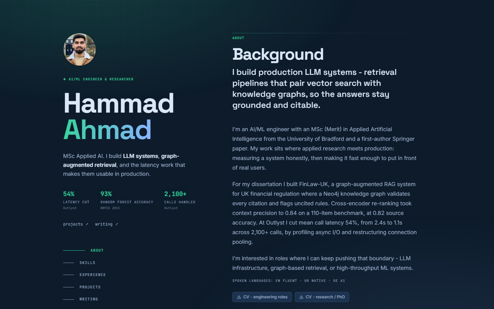
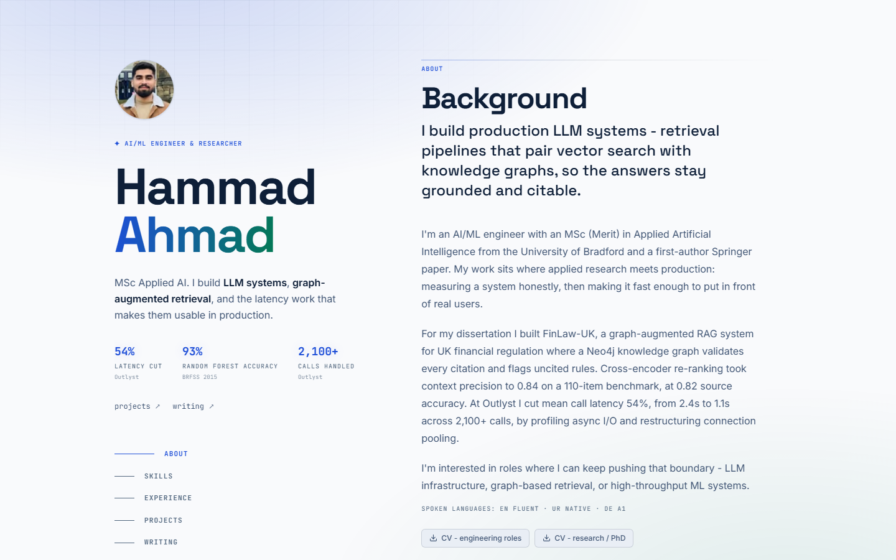
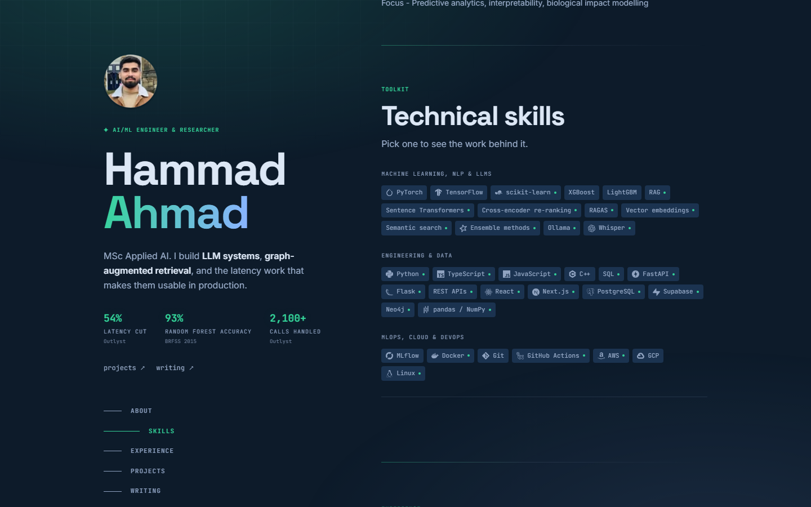
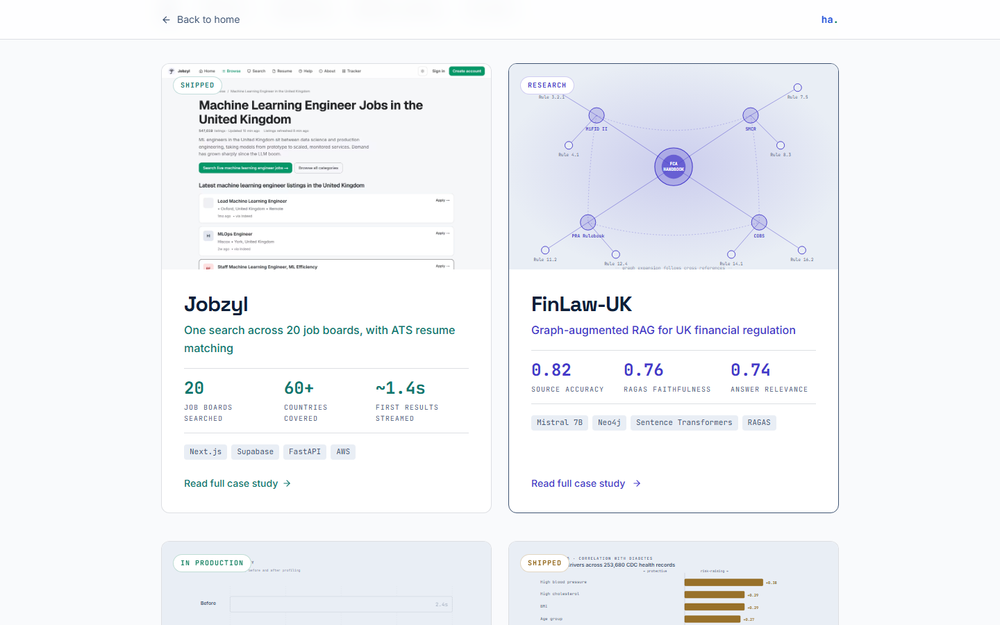
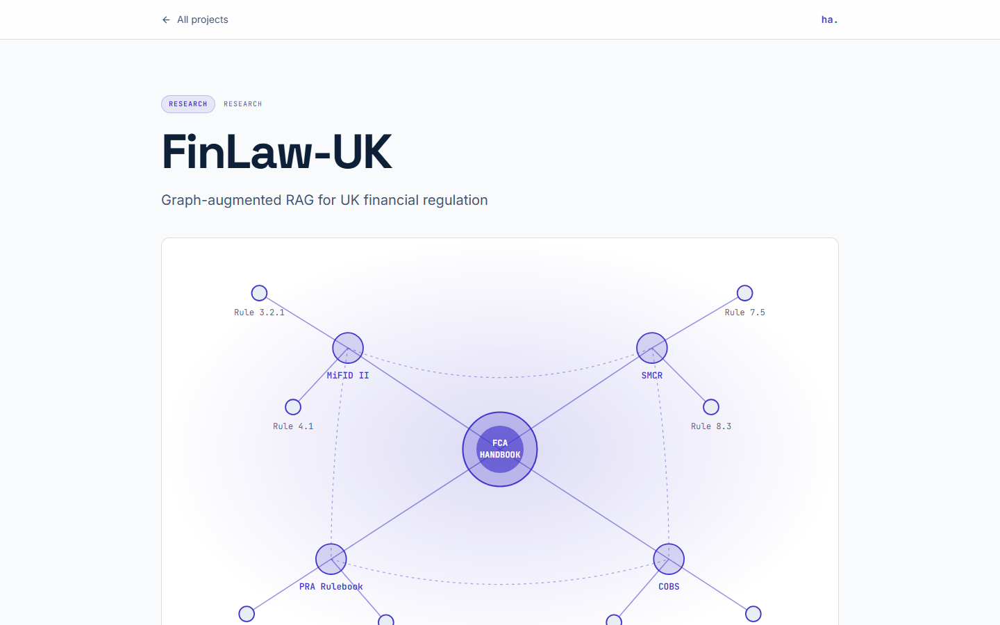
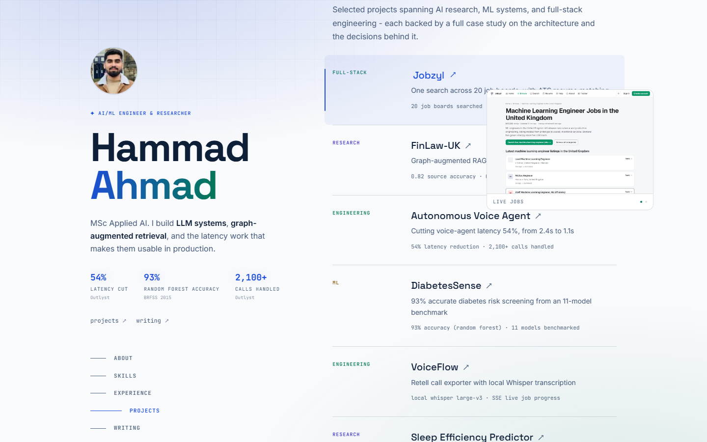
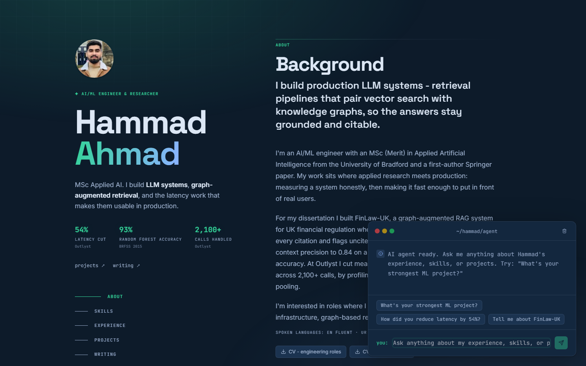
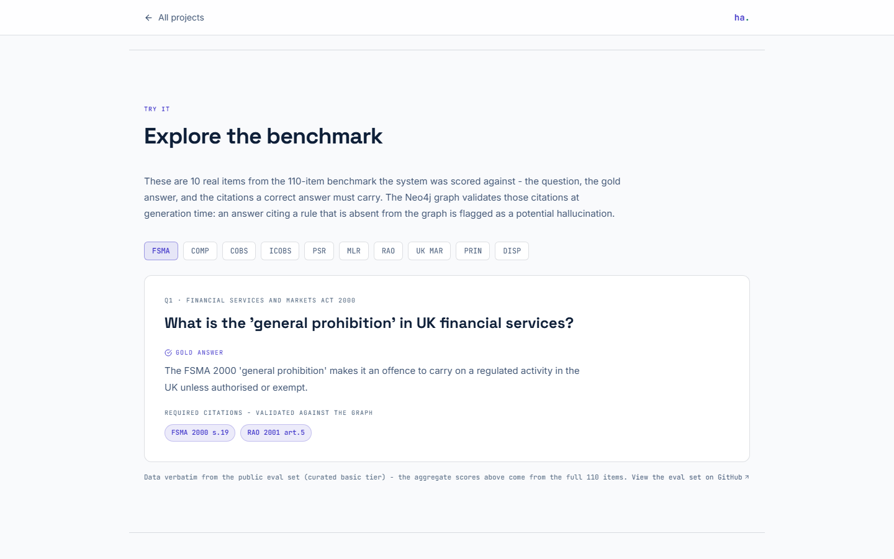

<div align="center">

# ha.

**Personal portfolio for Hammad Ahmad - AI/ML Engineer & Researcher.**<br>
Next.js 15 App Router, TypeScript, Tailwind. No animation library, no CMS, no UI kit.

[](https://hammadahmad.co.uk)
[](https://github.com/1oNN/portfolio/actions/workflows/ci.yml)
[](#license)

[](https://nextjs.org)
[](https://react.dev)
[](https://www.typescriptlang.org)
[](https://tailwindcss.com)
[](https://aws.amazon.com)
[](https://groq.com)

### [→ hammadahmad.co.uk](https://hammadahmad.co.uk)

<a href="https://hammadahmad.co.uk">
  
</a>

<sub>Click the shot to open the live site.</sub>

**[Live](https://hammadahmad.co.uk)** · [Screenshots](#screenshots) · [Tech stack](#tech-stack) · [Quick start](#quick-start) · [Engineering notes](#engineering-notes)

</div>

---

## Screenshots

<table>
<tr>
<td width="50%" valign="top">
<a href="https://hammadahmad.co.uk"></a>
<sub><b>Light paper theme.</b> Dark-first design with a client-side toggle. Every colour is a CSS custom property, so the theme is one token swap.</sub>
</td>
<td width="50%" valign="top">
<a href="https://hammadahmad.co.uk/#skills"></a>
<sub><b>Skills, wired to the work.</b> Pick a skill and it surfaces the projects that use it, derived from project <code>tech</code> and case-study <code>primaryStack</code> - never a hand-maintained list.</sub>
</td>
</tr>
<tr>
<td width="50%" valign="top">
<a href="https://hammadahmad.co.uk/projects"></a>
<sub><b>Six case studies.</b> Filtered by discipline, each with a full write-up of the architecture and the decisions behind it.</sub>
</td>
<td width="50%" valign="top">
<a href="https://hammadahmad.co.uk/projects/finlaw-uk"></a>
<sub><b>Hand-authored SVG.</b> No chart library and no exported images - every diagram, graph, and results chart is authored SVG that themes with the page.</sub>
</td>
</tr>
<tr>
<td width="50%" valign="top">
<a href="https://hammadahmad.co.uk/#projects"></a>
<sub><b>Hover a project, see it work.</b> A pointer-following panel cycles that project's own case-study visuals. It is <code>pointer-events: none</code>, which is what stops it stealing hover from the row underneath, so travelling between rows never flickers.</sub>
</td>
<td width="50%" valign="top">
<a href="https://hammadahmad.co.uk"></a>
<sub><b>Ask the agent anything.</b> <kbd>Ctrl</kbd>+<kbd>K</kbd> anywhere on the site opens a chat console grounded in the CV. Real LLM, rate-limited per session, with prompt-injection guards in front of it.</sub>
</td>
</tr>
<tr>
<td colspan="2" valign="top">
<a href="https://hammadahmad.co.uk/projects/finlaw-uk"></a>
<sub><b>Interactive demos that only ever render real data.</b> The FinLaw benchmark explorer serves 10 verbatim items from the published 110-item eval set; the diabetes factor explorer runs on BRFSS 2015. Nothing here is illustrative filler.</sub>
</td>
</tr>
</table>

---

## Features

- **Editorial home page** - two-column layout with a sticky identity rail and scroll-spy nav, covering About, Skills, Experience, Projects, Writing, Publications, and Contact
- **Six project case studies** with hand-built SVG visuals, results charts, and two interactive demos backed by published data only
- **Hover previews on the project rows** - a pointer-following panel that cycles each project's own visuals, capability-gated so touch devices attach no handlers at all
- **AI chat console** (Groq, `llama-3.1-8b-instant`) on <kbd>Ctrl</kbd>+<kbd>K</kbd> from any page, with prompt-injection guards in `lib/agent-guard.ts`
- **Interactive skills section** that derives skill → project links from real data instead of a maintained mapping
- **Blog** with table of contents, reading progress, copy-link headings, prev/next, and a DynamoDB-backed admin panel
- **Contact form** with AWS SES delivery, plus CV downloads with tracking
- **SEO** - per-page OpenGraph images, JSON-LD (Person, ScholarlyArticle, BlogPosting, BreadcrumbList, CollectionPage), sitemap, robots, web manifest
- **Dark/light theming** on CSS custom properties, toggled client-side
- **A sub-second entrance intro**, once per session, decided before first paint so it never covers an already-painted page

## Tech stack

| Layer | Choice | Notes |
| --- | --- | --- |
| Framework | Next.js 15 (App Router), React 18 | ISR on the home page, static case studies |
| Language | TypeScript 5.5, Node 20+ | `tsc --noEmit` is part of CI |
| Styling | Tailwind CSS 3.4 | CSS custom properties carry the token layer |
| Type / fonts | Inter, Space Grotesk, JetBrains Mono | `next/font/google` - self-hosted at runtime, fetched at build time (see the note below) |
| Visuals | Hand-authored SVG | No chart library, no animation library |
| AI agent | Groq - `llama-3.1-8b-instant` | Input filter + output canary in front of it |
| Email | AWS SES | Contact form delivery |
| Database | AWS DynamoDB | Blog posts, contacts, agent logs, CV downloads |
| Hosting | AWS Amplify Hosting (SSR) | `amplify.yml` drives the build |
| CI | GitHub Actions | Type-check + production build on every push and PR |

Runtime dependencies are deliberately few: `next`, `react`, `next-themes`, `react-icons`, `clsx`, `tailwind-merge`, `uuid`, and three AWS SDK clients. That's the whole list.

## Quick start

```bash
git clone https://github.com/1oNN/portfolio.git
cd portfolio
npm install
npm run dev
```

Open [localhost:3000](http://localhost:3000).

**It runs with no credentials at all.** The blog falls back to the posts bundled in `lib/seed-posts.ts`, the agent returns a 503, download tracking is skipped, and the contact form reports success locally without sending. In production that last path is deliberately different: an unconfigured contact route returns a 500 rather than a success it cannot back.

### Scripts

```bash
npm run dev          # local dev server
npm run build        # production build
npm start            # serve a production build
npm run type-check   # TypeScript check
npm run lint         # ESLint
```

---

## Configuration

<details>
<summary><b>Environment variables</b> - the full <code>.env.local</code>, and why AWS keys carry an <code>APP_</code> prefix</summary>

<br>

Create `.env.local`:

```ini
ADMIN_PASSWORD=your-strong-password
SESSION_SECRET=at-least-32-random-characters
ANALYTICS_SECRET=optional-secret-for-reading-page-view-counts

APP_AWS_REGION=eu-central-1
APP_AWS_ACCESS_KEY_ID=
APP_AWS_SECRET_ACCESS_KEY=
SES_FROM_EMAIL=your-verified@email.com
CONTACT_TO_EMAIL=where-contact-mail-should-arrive@example.com

DYNAMODB_BLOG_TABLE=portfolio-blog
DYNAMODB_CONTACTS_TABLE=portfolio-contacts
DYNAMODB_AGENT_TABLE=portfolio-agent-logs
DYNAMODB_DOWNLOADS_TABLE=portfolio-downloads

GROQ_API_KEY=
NEXT_PUBLIC_SITE_URL=https://hammadahmad.co.uk
```

**Why `APP_AWS_*` and not `AWS_*`:** Amplify's SSR compute exposes no usable credentials to the runtime, so the app carries its own IAM user. Lambda reserves `AWS_ACCESS_KEY_ID` and `AWS_SECRET_ACCESS_KEY` for the execution role and refuses them as function environment variables, hence the prefix. If the `APP_AWS_*` pair is absent, `lib/aws.ts` falls back to the default provider chain, so local development still works from a profile or SSO.

**Region:** `APP_AWS_REGION` defaults to `eu-central-1`, where the SES identity and the DynamoDB tables live. `AWS_REGION` is deliberately *not* read as a fallback: Lambda always injects it with the function's own region, so it is never absent in production and would quietly override the default, making the region an accident of where Amplify runs the function rather than a decision. SES identities do not replicate across regions - an address verified in one region is unverified everywhere else.

`ANALYTICS_SECRET` is optional and gates only the read side of `/api/analytics`. The write side is an unauthenticated browser beacon by design, and stores nothing but a path and a counter.

</details>

<details>
<summary><b>AWS setup</b> - DynamoDB tables, SES verification, IAM policy</summary>

<br>

**1. DynamoDB tables** (partition key `id`, type String):

| Table | Used for |
| --- | --- |
| `portfolio-blog` | Blog posts (read + write) |
| `portfolio-contacts` | Contact form submissions (write-only) |
| `portfolio-agent-logs` | Agent conversation logs (write-only) |
| `portfolio-downloads` | CV download tracking (write-only) |

**2. SES:** verify `SES_FROM_EMAIL` in the AWS SES console. In the SES sandbox, `CONTACT_TO_EMAIL` has to be verified too.

**3. IAM permissions** for the credentials above:

- `ses:SendEmail` on the from-address identity
- `dynamodb:PutItem`, `GetItem`, `UpdateItem`, `DeleteItem`, `Scan` on `portfolio-blog`
- `dynamodb:PutItem` on `portfolio-contacts`, `portfolio-agent-logs`, and `portfolio-downloads`

</details>

<details>
<summary><b>Deployment</b> - AWS Amplify, and the one non-obvious build step</summary>

<br>

Connect the repo in the Amplify Console, set the environment variables there, and let `amplify.yml` handle the build. Amplify auto-detects Next.js SSR.

One non-obvious step lives in the build phase: Amplify Console variables exist at **build time only**, and the SSR Lambda that serves the API routes does not inherit them. So the build appends the runtime-needed ones to `.env.production` before `npm run build`. `AWS_*` names are deliberately excluded from that filter for the reason given in the environment variables section above.

> If a route starts returning 500s for a key that is clearly set in the Console, that filter list is the first place to look.

</details>

<details>
<summary><b>CI</b></summary>

<br>

`.github/workflows/ci.yml` runs `npm run type-check` and `npm run build` on every push and PR to `main`, with dummy values for the build-time secrets. There is no test framework - type-check plus a clean build is the gate.

</details>

---

## Project structure

```
app/
  admin/          → Cookie-gated post editor (HMAC session, see middleware.ts)
  api/            → agent, contact, blog, admin/login, track-download, analytics, health
  blog/, projects/→ Listings, detail pages, and per-slug opengraph-image routes
components/
  blog/           → PostCard, TableOfContents, CopyLink
  case-study/     → CaseStudyLayout, ListingCard, AskAgentChip
  interactive/    → Theme toggle, TerminalAgent + AgentConsole (Ctrl+K),
                    ProjectPreview (hover panel), IntroOverlay, CountUp, beacon
  layout/         → LeftRail + RailNav (home identity rail), ChatRailButton, Footer
  project-visuals/→ Per-project hero, architecture, results, and demo visuals
  sections/       → About, Skills, Experience, HomeProjects, HomeWriting,
                    Publications, Contact, CvDownloads
  ui/             → SectionHeader
hooks/            → useTerminalAgent, useTypewriter
lib/              → constants, case-studies, cv-config, post-labels, seed-posts,
                    blog-db, auth, aws, agent-system-prompt, agent-guard, markdown,
                    metadata, json-ld, og-font, reading-time, demo-data
types/            → TypeScript interfaces
public/cv/        → Downloadable CVs
```

## Engineering notes

The parts of this codebase that will bite you if you assume the obvious.

<details>
<summary><b>Rendering strategy</b></summary>

<br>

The home page is ISR (`revalidate = 300`) because it reads published posts; blog pages revalidate every 60s. Project pages set `dynamicParams = false` so an unknown slug is a real 404 rather than a soft one. Blog deliberately does not, since a newly published post has to render without a rebuild.

</details>

<details>
<summary><b>Theming traps</b></summary>

<br>

Never put `#fff` or `text-white` on an accent fill - use the `--accent-contrast` token.

An inline `style={{ color }}` silently kills the matching Tailwind `hover:` class, so base values for a hovered property must be bracket classes. Every hover needs a `focus-visible` twin.

</details>

<details>
<summary><b>Agent safety</b></summary>

<br>

An 8B model does not hold the line on instructions alone, so `lib/agent-guard.ts` adds an input filter (refuses before spending a Groq call) and an output canary on distinctive system-prompt substrings. When editing the system prompt, keep the canary list in sync.

</details>

<details>
<summary><b>Content: CVs, seed posts, markdown</b></summary>

<br>

**CV publishing.** Two CVs ship from `public/cv/`, labelled by audience. To add or swap one, drop the PDF in and edit `AVAILABLE_CVS` in `lib/cv-config.ts` - the About chips, the agent prompt, and the download-tracking validation all read that list. An empty list hides the CV UI entirely.

**Seed posts.** `lib/seed-posts.ts` ships posts inside the bundle so the blog has content without a DB write. They are merged into the published read path only, and a real DB post always wins on a slug collision.

**Markdown.** `lib/markdown.ts` is a hand-rolled, XSS-safe parser that also returns heading slugs for the table of contents. Quirk to design around: a paragraph placed directly after a blockquote renders unwrapped.

</details>

<details>
<summary><b>Fonts and OG images</b></summary>

<br>

Inter (body), Space Grotesk (`--font-display`, all headings), and JetBrains Mono (`--font-mono`, eyebrows and metrics). The OG image route embeds Space Grotesk as base64 in `lib/og-font.ts`, because satori cannot read woff2.

**The build has a network dependency, and it will fail on you.** `next/font/google` self-hosts the fonts in the build *output*, so the shipped site makes no external font requests - but it fetches them from Google Fonts *during the build*. A Google Fonts blip therefore fails the build outright:

```
NextFontError: Failed to fetch `JetBrains Mono` from Google Fonts.
> Build failed because of webpack errors
```

That happened here on a green commit and passed on re-run with no code change, so treat a lone font-fetch failure as transient before hunting for a real cause. It can hit the Amplify build as easily as CI. The permanent fix is `next/font/local` with the woff2 files committed, which removes the dependency entirely.

</details>

<details>
<summary><b>Security headers and Docker</b></summary>

<br>

CSP and the rest of the security headers are set in `next.config.js`, not at the edge.

`Dockerfile` and `docker-compose.yml` are kept for a self-hosted path but are **not** how the site deploys and are not currently wired up. The image expects `output: "standalone"` in `next.config.js` (absent), and the compose file still passes the pre-`APP_` credential names.

</details>

---

## License

MIT

<div align="center">
<br>
<sub>Built by <a href="https://hammadahmad.co.uk">Hammad Ahmad</a> · <a href="https://hammadahmad.co.uk">hammadahmad.co.uk</a></sub>
</div>
